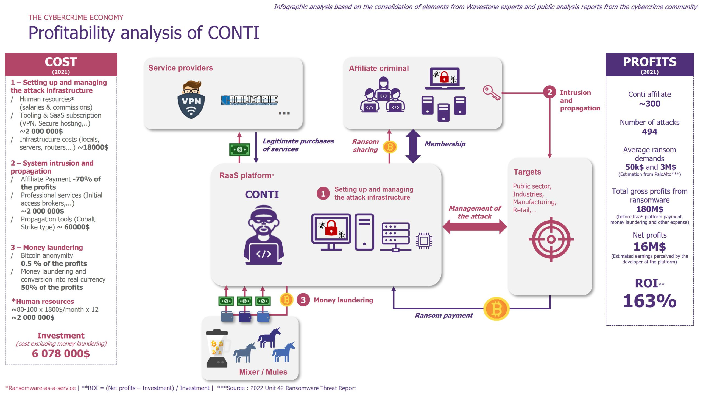
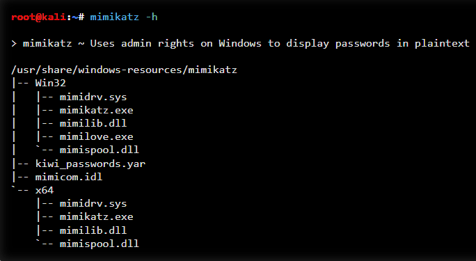
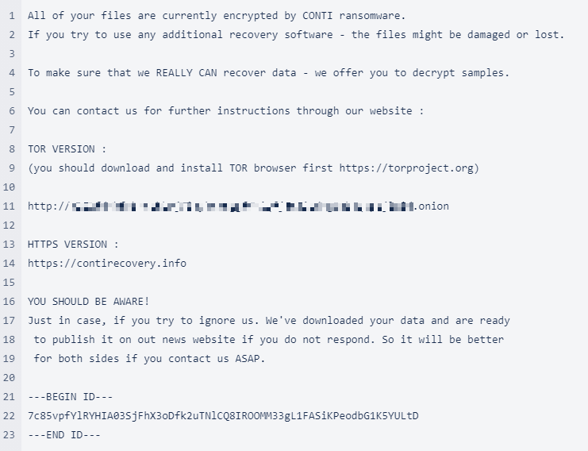

# 🛡️ Conti Ransomware – Análisis técnico y medidas defensivas / Technical Analysis & Defensive Measures

## 🇪🇸 Descripción

Este proyecto documenta el funcionamiento del ransomware Conti, una de las amenazas más sofisticadas entre 2020 y 2022. Se analizan sus vectores de ataque, tácticas de persistencia, métodos de extorsión y estrategias de protección. El informe incluye recursos educativos, referencias técnicas y recomendaciones para prevenir y responder ante incidentes.

## 🇬🇧 Overview

This project documents the operation of Conti ransomware, one of the most sophisticated threats between 2020 and 2022. It analyzes attack vectors, persistence tactics, extortion methods, and protection strategies. The report includes educational resources, technical references, and recommendations for prevention and incident response.

---

## 🧰 Herramientas / Tools Used

- 🧠 Mimikatz (credential theft)
- ⚙️ PsExec & PowerShell (lateral movement)
- 📄 GitHub: Ransomware Simulator
- 🎓 TryHackMe walkthroughs
- 📚 Educational articles & videos

---

## 📚 Documentación / Documentation

| Archivo | Descripción | Idioma |
|--------|-------------|--------|
| [`conti_report_ES.md`](./docs/conti_report_ES.md) | Informe técnico completo | Español 🇪🇸 |
| [`conti_report_EN.md`](./docs/conti_report_EN.md) | Full translated report | English 🇬🇧 |
| [`conclusions_ES_EN.md`](./docs/conclusions_ES_EN.md) | Conclusión bilingüe | ES / EN 🇪🇸🇬🇧 |

---

## 🖼️ Evidencias / Visual Evidence

📁 [`/assets`](./assets)

### 🔐 Diagrama del flujo de ataque de Conti  

### 🧠 Uso de Mimikatz para escalamiento  

### 📄 Ejemplo de nota de rescate  

---

## 🛡️ Estrategias de protección / Protection Strategies

- ✅ Prevención: capacitación, MFA, actualizaciones
- 🚨 Respuesta: backups, segmentación, EDR
- 🔁 Recuperación: planes de contingencia, evaluación de impacto

---

## 📎 Referencias / References

- [Conti Ransomware Analysis – GitHub](https://github.com/topics/conti-ransomware)
- [TryHackMe – Conti Walkthrough](https://tryhackme.com)
- [Mimikatz Tool](https://github.com/gentilkiwi/mimikatz)
- [EDR Solutions Overview](https://www.crowdstrike.com/endpoint-security/)
- [Ransomware Simulator – GitHub](https://github.com/NextronSystems/ransomware-simulator)

---

## 🙋‍♀️ Autora / Author

**Jocelyne Herrera Hidalgo**  
Bilingual Cybersecurity Student 

